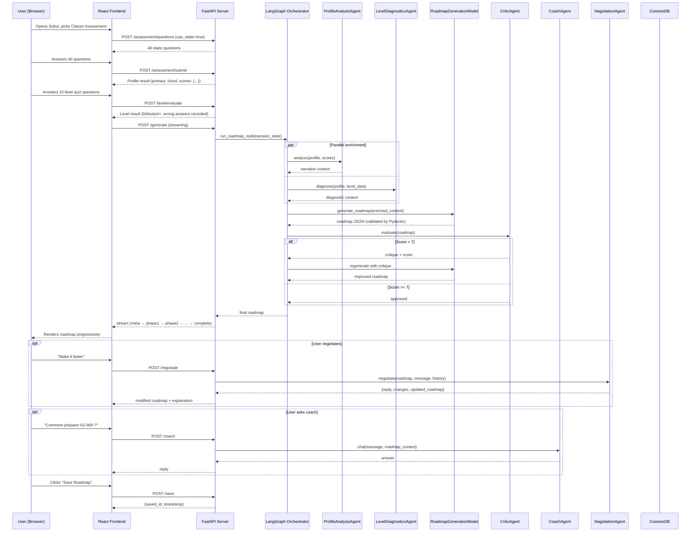
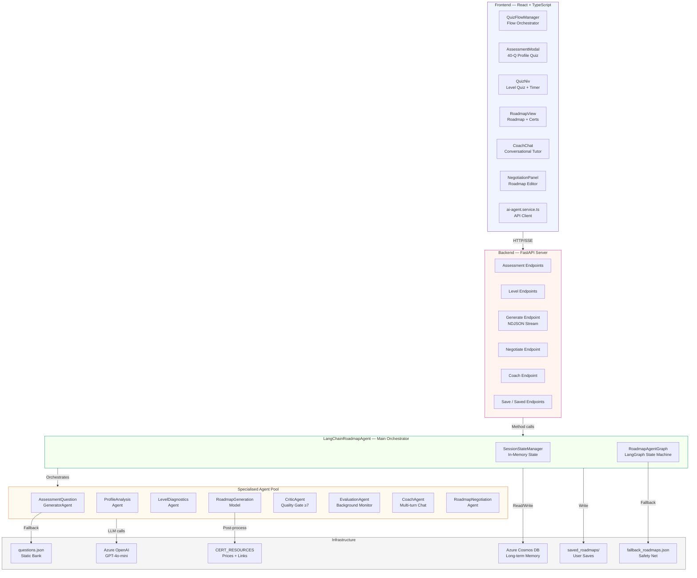

# Analysis of Subul — A Multi-Agent System for Personalized Certification Roadmap Generation

---

## 1. Introduction (Teacher-style explanation)

### What is Subul?

Welcome, everyone. Today we are going to analyse a project that I find genuinely exciting — not just because of its technical ambition, but because of the *problem it solves*. The project is called **Subul** (سُبُل — Arabic for "paths"), and it is an AI-powered platform that generates personalised certification roadmaps for learners in the fields of **Cloud Computing**, **Cybersecurity**, **Artificial Intelligence**, and **IoT (Internet of Things)**.

The challenge Subul addresses is one that any student who has typed "how do I become a cloud engineer?" into a search engine will recognise: you are instantly overwhelmed by contradictory advice, outdated forum posts, and an endless list of certifications with no clear order or rationale. Subul's answer is to *not give you a generic answer* — instead, it interviews you, measures you, and builds a unique, step-by-step certification path that is calibrated to *your current level, your interests, and your available time*.

### Why Multi-Agent Systems?

Now, why would we use a **multi-agent system (MAS)** to solve this? A single AI model could certainly generate a generic roadmap. But personalisation at this depth requires *specialised expertise working in parallel*. Think of it this way:

> **Analogy for the classroom:** Imagine you walk into a university and say "I want to become a cybersecurity expert." A single receptionist cannot help you properly. Instead, you are directed to: an *admissions assessor* who tests your background, a *diagnostic professor* who evaluates your current skill level, a *curriculum designer* who builds your exact program, a *quality reviewer* who checks the program makes sense, and a *personal tutor* available whenever you have questions. Each person has a **specialised role**, they **share information** about you, and together they produce something far better than any one of them could alone. That is exactly what a multi-agent system is.

A **multi-agent system** is an architecture composed of multiple autonomous software agents — each with a defined role, its own tools, and its own knowledge — that coordinate to achieve a goal no single agent could accomplish efficiently on its own.

Subul implements this pattern with **8 specialised agents** orchestrated by a **LangGraph state machine**, backed by a **FastAPI server**, and presented through a **React/TypeScript frontend**.

---

## 2. Resources Created with This Project

Subul is not just a conversation interface — it produces and manages a rich set of **concrete resources** at multiple layers of the system.

### 2.1 User-Facing Resources (the "product")

| Resource | Format | How it is generated | Why it matters |
|---|---|---|---|
| **Personalised Certification Roadmap** | JSON → rendered UI | LLM (GPT-4o-mini) via `RoadmapGenerationModel` + `CriticAgent` | The core deliverable — a multi-phase learning path tailored to the user |
| **Profile Assessment Result** | JSON | 40-question scoring engine in `AssessmentSystem` | Identifies the learner's dominant domain (Cloud/Cyber/AI/IoT) |
| **Skill Gap Analysis** | JSON | `SkillGapAnalyzer` class | Shows exactly *where* the learner is weak and *what* to study next |
| **Level Evaluation Result** | JSON | `LevelQuizSystem` with 10 domain-specific questions | Determines Débutant / Intermédiaire / Expert so the roadmap is correctly calibrated |
| **Weekly Study Plan** | JSON embedded in Roadmap | LLM generation (Pydantic `WeeklyPlanItem`) | Week-by-week breakdown so learning is never overwhelming |
| **Career Outcomes Section** | JSON embedded in Roadmap | LLM generation (Pydantic `CareerOutcome`) | Shows job titles, salary ranges and company types to motivate the learner |
| **Saved Roadmaps** | JSON files on disk | `save_roadmap()` in `LangChainRoadmapAgent` | Persists up to 10 roadmaps per user in `saved_roadmaps/{user_id}.json` |
| **Negotiated / Modified Roadmap** | JSON | `RoadmapNegotiationAgent` (multi-turn LLM) | User can refine their roadmap conversationally ("make it faster", "replace AZ-104") |
| **Benchmark Comparison** | JSON | `BenchmarkingSystem` | Percentile ranking vs. other learners — motivating and informative |

### 2.2 System-Level Resources (the "infrastructure")

| Resource | Format | Location | Purpose |
|---|---|---|---|
| **Session State** | In-memory `AgentState` dict | `SessionStateManager` | Carries all data between agents within a session |
| **Conversation Histories** | In-memory lists | `CoachAgent._histories`, `RoadmapNegotiationAgent._histories` | Multi-turn context for the coach and negotiation flows |
| **LLM-Generated Assessment Questions** | JSON list | `_session_questions` dict (per session) | Dynamic question bank generated fresh by `AssessmentQuestionGeneratorAgent`, stored per-session for consistent scoring |
| **CosmosDB Learning Context** | Cloud document | Azure Cosmos DB via `RoadmapMemoryManager` | Long-term personalisation — returning users get roadmaps that already know their history |
| **Static Fallback Roadmaps** | JSON file | `fallback_roadmaps.json` | Guarantees the user always gets *something* even if the LLM fails entirely |
| **Static Question Bank** | JSON file | `questions.json` (40 questions) | Domain-weighted question bank used when LLM generation is unavailable |
| **Exam Resource Map** | Hardcoded Python dict | `CERT_RESOURCES` in `langchain_agent.py` | Authoritative prices and official links for 30+ certifications — never hallucinated by LLM |
| **Progress Log** | In-memory + optional CosmosDB | `ProgressTracker` | Records every assessment session for trend analysis |

### 2.3 How the Core Resource (the Roadmap) is Generated

The roadmap JSON is the most complex resource. Here is its structure:

```json
{
  "roadmap_title": "Parcours Cloud Engineer — Azure",
  "roadmap_summary": "...",
  "total_estimated_weeks": 52,
  "total_certifications": 5,
  "user_level": "Débutant",
  "phases": [
    {
      "phase_number": 1,
      "phase_name": "Fondamentaux Cloud",
      "level_tier": "Fondamental",
      "duration_weeks": 8,
      "certifications": [
        {
          "nom": "Azure Fundamentals",
          "code": "AZ-900",
          "provider": "Microsoft",
          "heures_etude": 40,
          "duree_preparation_semaines": 8,
          "pourquoi_cette_certif": "Point d'entrée incontournable...",
          "competences_acquises": ["Cloud computing", "Azure services", ...],
          "plan_semaine": [...],
          "prix_examen_eur": "165 €",
          "lien_formation_officielle": "https://learn.microsoft.com/..."
        }
      ]
    }
  ],
  "debouches": [...],
  "conseil_final": "..."
}
```

This JSON is **validated by Pydantic** before it ever reaches the user, meaning the LLM cannot output a malformed or incomplete roadmap without triggering an automatic retry.

---

## 3. How It Works (Step-by-Step Workflow)

Let me walk you through the complete end-to-end flow as if we were tracing a single user session from first click to saved roadmap.

### Phase 0 — Mode Selection

The user opens Subul and sees two options:
- **Évaluation Adaptative** — 6 to 10 questions, stopped early by a Computer Adaptive Testing (CAT) algorithm when the system is confident enough
- **Évaluation Classique** — 40 questions from the static bank, covering all four domains evenly

> 💡 **CAT (Computer Adaptive Testing)** is the same technique used by professional certification exams like GRE. After each answer, the algorithm selects the *next most informative question* based on the current score estimate. It stops when the uncertainty drops below a threshold — meaning you can detect a profile with far fewer questions.

---

### Phase 1 — Profile Assessment

**Step 1.** The frontend calls `POST /api/roadmap/assessment/questions`. The server's `AssessmentQuestionGeneratorAgent` attempts to generate 20 fresh LLM questions (5 per domain). If it fails, the server falls back to the static `questions.json` bank.

**Step 2.** The user answers questions. Each option carries a **multi-domain score vector**, e.g.:
```json
"A": { "cloud": 10, "cyber": 2, "ai": 4, "iot": 0 }
```
This means choosing A contributes 10 points to Cloud, 2 to Cyber, etc.

**Step 3.** `POST /api/roadmap/assessment/submit` sends answers. `AssessmentSystem.calculate_profile()` sums all domain scores, normalises them to percentages, and returns the **primary profile** (dominant domain) and an optional **secondary profile** (within 20% of primary).

**Step 4.** A `SkillGapAnalyzer` runs simultaneously, identifying which domains scored below the 50% threshold and generating a prioritised list of concepts to improve.

**Step 5.** The session state is updated with the profile result via `record_assessment_result()`.

---

### Phase 2 — Level Evaluation

**Step 6.** The user is presented with 10 questions specific to their detected domain (e.g., 10 cloud-specific technical questions for a Cloud profile).

**Step 7.** `POST /api/roadmap/level/evaluate` scores the answers and determines the level:

| Score | Level |
|---|---|
| < 40% | Débutant |
| 40–59% | Débutant+ |
| 60–74% | Intermédiaire |
| 75–89% | Intermédiaire+ |
| ≥ 90% | Expert |

**Step 8.** Any **wrong answers are recorded** with their question text. These will later be injected into the roadmap prompt as explicit skill gaps: *"the user failed questions on X, Y, Z — address these directly in the roadmap."*

---

### Phase 3 — Roadmap Generation (The Heart of the System)

This is where the multi-agent orchestration is most visible.

**Step 9.** `POST /api/roadmap/generate` triggers the LangGraph workflow.

**Step 10.** Two sub-agents run **in parallel** (using `asyncio.gather`):
- `ProfileAnalysisAgent` — writes a narrative paragraph about the user's domain scores ("your Cloud score of 72% suggests strong infrastructure intuition but your AI score of 31% suggests you have not yet explored data science")
- `LevelDiagnosticsAgent` — writes a pedagogical diagnosis ("as a Débutant+, you have grasped fundamentals but need structured exposure to real-world scenarios before attempting Associate-level exams")

**Step 11.** The outputs from both sub-agents, plus the wrong quiz answers from Step 8, are assembled into a rich `memory_context` string injected into the roadmap generation prompt.

**Step 12.** `RoadmapGenerationModel` calls Azure OpenAI (GPT-4o-mini) with this enriched context. The response is parsed and validated against the `RoadmapOutput` Pydantic schema. If validation fails, the model retries up to 2 times, feeding the validation error back into the prompt so the LLM can self-correct. This is called **self-healing generation**.

**Step 13.** `CriticAgent` reviews the generated roadmap, scoring it 1–10 across four criteria:
1. Correct certification ordering (no AZ-305 before AZ-900)
2. Level appropriateness for the user
3. Realistic time estimates
4. Quality of study advice

If the score is **below 7**, the roadmap is rejected and regenerated with the critique injected as additional instructions. This is the **quality gate**.

**Step 14.** `inject_resources()` post-processes the roadmap, inserting hardcoded exam prices and official links from `CERT_RESOURCES` — ensuring these critical pieces of information are **never hallucinated by the LLM**.

**Step 15.** The roadmap is **streamed** to the frontend as NDJSON (Newline-Delimited JSON). First the metadata arrives, then each phase arrives one by one, allowing the UI to render certification cards progressively rather than waiting for the entire JSON.

**Step 16.** `EvaluationAgent` scores the final quality silently in the background (`asyncio.create_task`) without blocking the user.

---

### Phase 4 — Negotiation and Coaching

**Step 17.** The user can open the **Negotiation Panel** and send natural-language modification requests. Each request goes to `POST /api/roadmap/negotiate`. The `RoadmapNegotiationAgent` maintains a conversation history, sends the current roadmap JSON + the user's request to GPT-4o-mini, and returns a modified roadmap + a human explanation of what changed.

**Step 18.** At any point the user can save the current (possibly negotiated) roadmap via `POST /api/roadmap/save`.

**Step 19.** The user can open the **Coach Chat** panel and ask questions like "how do I prepare AZ-900 in 4 weeks?". `CoachAgent` maintains per-session conversation history and answers in French using the roadmap as context.

---

### Complete End-to-End Flow Diagram



---

## 4. Architecture of the Project

### 4.1 Overview

Subul follows a **layered, event-driven architecture** with three distinct tiers:

1. **Presentation Tier** — React + TypeScript frontend (Vite)
2. **Orchestration Tier** — FastAPI + LangGraph backend
3. **Intelligence Tier** — Specialised LLM agents + Azure OpenAI

The backend is best understood as two concentric rings: an **outer ring** of FastAPI endpoints (the HTTP API) and an **inner ring** of LangGraph-orchestrated agents (the intelligence layer).

---

### 4.2 Component Breakdown

#### 🧩 Frontend Components

| Component | Role |
|---|---|
| `QuizFlowManager.tsx` | **Orchestrator** — manages the flow state machine (mode-select → assessment → quiz → generating → done) |
| `AssessmentModal.tsx` | Classic 40-question profile detection UI |
| `QuizNiv.tsx` | Level evaluation quiz with 60s countdown timer and live difficulty meter |
| `RoadmapView.tsx` | Renders the full roadmap with cert cards, weekly plans, career outcomes |
| `CoachChat.tsx` | Side-panel conversational coach |
| `NegotiationPanel.tsx` | Split-screen negotiation interface (live roadmap + chat) |
| `ProgressDashboard.tsx` | Progress history, score trends, benchmarks |
| `ai-agent.service.ts` | HTTP client for all API calls — single source of truth for endpoint contracts |

#### 🔧 Backend: FastAPI Layer

The FastAPI server (`langchain_api_server.py`) is a **thin orchestration layer** — it validates requests, routes them to the correct agent method, and streams responses. It intentionally contains *no business logic*. All intelligence lives in the agents.

Key design decisions:
- **Pydantic validation on all request models** — malformed input never reaches agents
- **NDJSON streaming** for roadmap generation — progressive rendering, no 30-second blank screen
- **Global agent singleton** — one `LangChainRoadmapAgent` instance shared across all requests

#### 🤖 Agents

Let us classify the 8 agents by their role in the system:

| Agent | Type | Role | Trigger |
|---|---|---|---|
| `AssessmentQuestionGeneratorAgent` | **Generator** | Creates fresh assessment questions via LLM | On each new assessment session |
| `ProfileAnalysisAgent` | **Analyst** | Writes a narrative profile context from domain scores | During roadmap generation (parallel) |
| `LevelDiagnosticsAgent` | **Analyst** | Writes a pedagogical learning diagnosis | During roadmap generation (parallel) |
| `RoadmapGenerationModel` | **Creator** | Calls GPT-4o-mini to generate the full roadmap JSON | Core generation step |
| `CriticAgent` | **Evaluator / Gatekeeper** | Scores roadmap quality 1–10, triggers re-generation if < 7 | After every roadmap generation |
| `EvaluationAgent` | **Monitor** | Logs long-term quality metrics in background | After roadmap is delivered (fire-and-forget) |
| `CoachAgent` | **Conversational** | Answers learner questions with multi-turn memory | On demand from the UI |
| `RoadmapNegotiationAgent` | **Editor** | Modifies roadmap from natural-language instructions | On demand from Negotiation Panel |

#### 🧠 LangGraph State Machine

**LangGraph** is a framework for building stateful, graph-based agent workflows. Think of it as a flowchart where each node is an agent and edges define the allowed transitions. The shared state (`AgentState`) acts as a **blackboard** — a shared memory space that all agents read from and write to.

```
AgentState = {
  profile, level, profile_data, level_data,
  roadmap_data, current_phase, memory_context, messages
}
```

Subul's graph has three nodes: `assessment → level_test → roadmap`. The transitions are conditional — the graph moves to the next node only when the required data is present in the state.

#### 🗃️ Memory Layers

Subul implements a **three-layer memory architecture**:

1. **Short-term (in-session)** — `SessionStateManager` holds the `AgentState` in a Python dictionary. Cleared when the session ends.
2. **Conversational (multi-turn)** — `CoachAgent` and `RoadmapNegotiationAgent` each maintain per-session message histories. Trimmed to the last N turns to control token cost.
3. **Long-term (cross-session)** — `RoadmapMemoryManager` persists learning history to **Azure Cosmos DB**, so returning users get roadmaps that know their past sessions and completed certifications.

---

### 4.3 High-Level Architecture Diagram



---

## 5. Key Added Value of This Project

### 5.1 What Makes Subul Special?

Most AI tutoring systems are **reactive** — you ask a question and get an answer. Subul is **proactive and diagnostic** — it measures you first, then plans for you. Let me highlight what is architecturally innovative here.

#### ✅ Adaptive Personalisation at Multiple Levels
Subul personalises at **three independent axes simultaneously**:
- **Domain** — what field you are strongest in (Cloud / Cyber / AI / IoT)
- **Level** — how advanced you are within that domain (Débutant → Expert)
- **Gaps** — specifically which topics you failed, injected as hard constraints into the roadmap prompt

No generic chatbot can replicate this because it requires *structured measurement first* and *constrained generation second*.

#### ✅ Self-Healing LLM Generation
The `CriticAgent` + Pydantic validation pattern means the system **never delivers a broken roadmap**. The LLM retries until it passes the quality gate. This is a production-grade reliability pattern that you almost never see in demo-level projects.

#### ✅ URL Hallucination Prevention
LLMs are notorious for inventing plausible-sounding but wrong URLs. Subul's `inject_resources()` post-processor **never asks the LLM for URLs or prices**. These are sourced exclusively from the hardcoded `CERT_RESOURCES` dictionary. This is a simple but professionally important design decision.

#### ✅ Streaming Progressive Rendering
Roadmap generation can take 10–30 seconds. Rather than showing a spinner, Subul streams each phase individually via NDJSON so the user sees certification cards appearing one by one. This dramatically improves **perceived performance**.

#### ✅ True Multi-turn Negotiation
The `RoadmapNegotiationAgent` maintains conversation history and applies modifications to the *existing roadmap JSON* rather than regenerating from scratch. This is more efficient (fewer tokens, faster response) and more precise (only changes what was asked).

#### ✅ Graceful Degradation at Every Step
Every single component has a fallback:

| Component | Primary | Fallback |
|---|---|---|
| Assessment questions | LLM-generated (20 questions) | Static `questions.json` (40 questions) |
| Level quiz | LLM-generated per profile | Static domain bank |
| Roadmap generation | LangGraph + all agents | `fallback_roadmaps.json` |
| Cert links/prices | `CERT_RESOURCES` dict | Field left null |
| CosmosDB | Full personalisation | Stateless session-only mode |

This means **the application never crashes from the user's perspective**.

---

### 5.2 Concrete Benefits

#### Performance
- **CAT mode reduces assessment time by 40–60%** compared to the full 40-question bank, by stopping early when the algorithm is confident
- **Parallel sub-agent execution** (ProfileAnalysis + LevelDiagnostics using `asyncio.gather`) saves 2–5 seconds per roadmap generation
- **Streaming** reduces Time-to-First-Content from ~25 seconds to ~3 seconds

#### Cost Efficiency
- Static questions (`use_static=true`) completely bypass LLM for classic mode — zero token cost for question loading
- `EvaluationAgent` runs as a background task (`asyncio.create_task`) — quality scoring does not block the user and can be rate-limited or disabled without user impact
- Conversation history trimming (last N turns) controls token cost for long coach sessions

#### Maintainability
- **Pydantic validation on all LLM outputs** means adding a new field to the roadmap requires changing one Pydantic model — the LLM automatically tries to fill it
- **Clean separation between agents** — each class has one responsibility, tested independently
- **Hardcoded resource map** (`CERT_RESOURCES`) makes updating exam prices a one-line change per certification

#### Real-World Academic / Business Value
- The platform directly addresses the **€2B+ online learning market** for IT certifications
- The CAT + skill-gap + roadmap pipeline could be adapted for **university course planning**, **corporate onboarding**, or **professional re-skilling programmes**
- The multi-turn negotiation feature models a **real counsellor-student interaction** that is typically expensive (human career counsellor time) and scales to unlimited concurrent users

---

## 6. Conclusion & Learning Takeaways

### Summary

Subul is a production-quality multi-agent system that demonstrates how to combine **structured data collection** (assessment), **diagnostic reasoning** (level evaluation + skill gap analysis), **constrained generative AI** (validated roadmap generation), **quality assurance** (CriticAgent), and **interactive refinement** (negotiation) into a seamless user experience.

The system was built progressively, feature by feature, which is itself an important lesson: **multi-agent systems are not designed in one sitting**. They grow as you identify new tasks that benefit from specialisation.

---

### Key Lessons for Students of Multi-Agent Systems

**1. Specialisation outperforms generalisation.**
> Eight focused agents, each doing one thing well, produce better results than one "do everything" prompt. The CriticAgent improves quality not because it is smarter — it uses the same LLM — but because *evaluating is a different cognitive task from creating*.

**2. State is the backbone of a multi-agent system.**
> `AgentState` in LangGraph is the glue that holds Subul together. Every agent reads from it and writes to it. Designing the state schema carefully — deciding what information flows between agents — is one of the most important architectural decisions you will make.

**3. Always design for failure.**
> Every agent in Subul has a fallback. The golden rule: *no agent failure should ever crash the system from the user's perspective*. Design happy paths and unhappy paths simultaneously.

**4. Validate LLM outputs — always.**
> LLMs produce creative, fluent text but are unreliable with structured data. Pydantic validation + self-correction retries is the industry-standard pattern for getting reliable JSON from LLMs. Never trust raw LLM output in a production system.

**5. Do not hallucinate facts — inject them.**
> The `inject_resources()` pattern is a model solution to factual hallucination. Separate what the LLM is good at (reasoning, text, structure) from what it is bad at (precise factual data like prices and URLs). Let the LLM do the former and inject the latter programmatically.

**6. Stream everything that takes more than 2 seconds.**
> Perceived performance is as important as actual performance. NDJSON streaming costs almost nothing to implement but dramatically improves user experience for long-running AI tasks.

**7. Memory is not one thing.**
> Subul demonstrates three layers: in-session state, per-conversation history, and cross-session persistence. Know which layer you need for which task. Not everything needs a database.

**8. Orchestration logic belongs in the orchestrator, not the agents.**
> `QuizFlowManager.tsx` on the frontend and `LangChainRoadmapAgent` on the backend own the *flow logic*. Individual agents (Coach, Negotiator, Critic) know nothing about the overall pipeline. This separation is what makes the system extensible — you can add a new agent without rewriting the others.

---

> *"The best systems are not those where one very smart component does everything — they are those where many well-designed components work together so smoothly that the complexity is invisible to the user."*
>
> — A lesson from Subul.

---

*Document generated: April 2026 | Project: Subul Certification Roadmap Agent | Architecture: FastAPI + LangGraph + React + Azure OpenAI*
